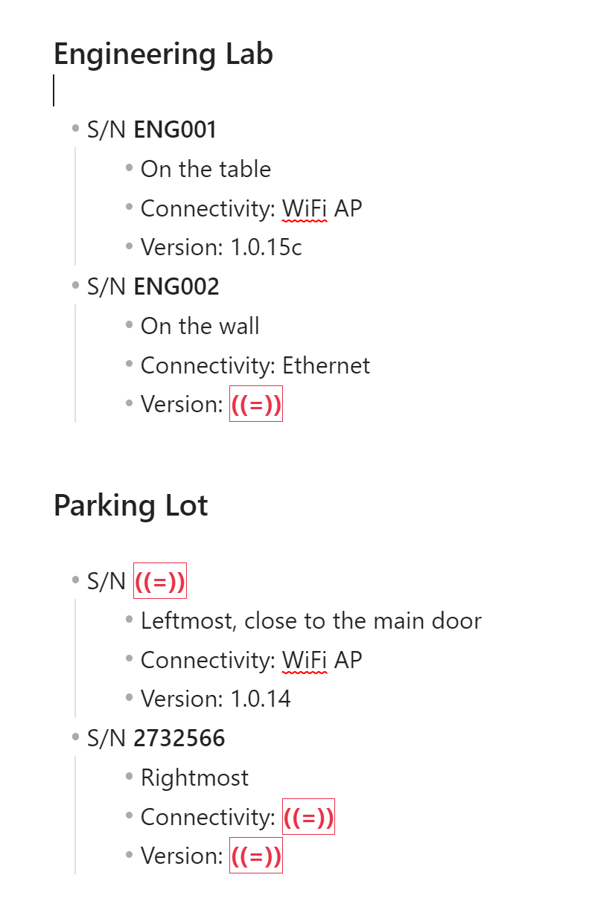
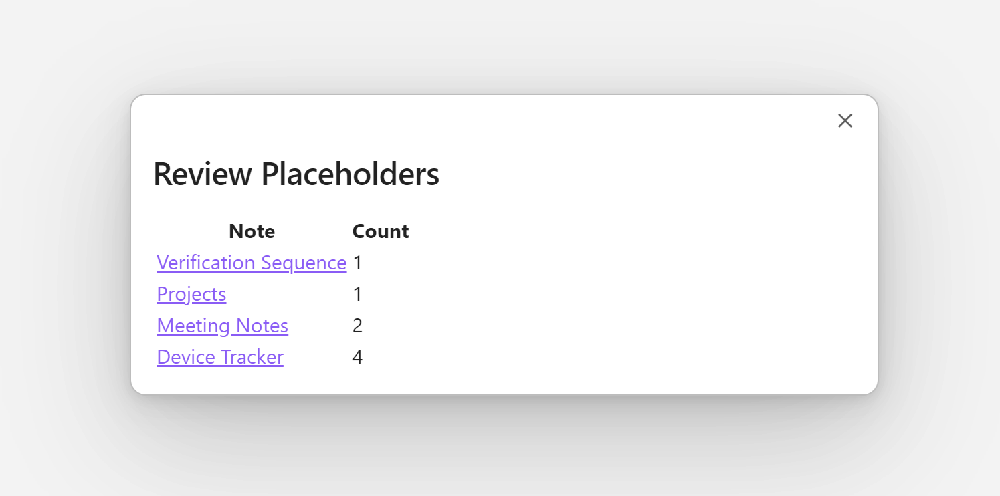

# Obsidian Placeholder Plugin

A plugin that let's you insert a custom placeholder string in your markdown notes, highlights them quite visibly in the note and optionally reminds you to review and fix them when you startup obsidian.

**Usage**

1. Type the default placeholder `((=))` into a note or use a custom placeholder that suits your workflow
2. When revisting the note, just edit the placeholder in-situ or click on the placeholder to subsitute it with context relevant information

**Plugin Options**

1. Enable/Disable "Review placeholders on start-up" in the settings page of the plugin
2. Configure custom placeholder

**Example**

**How is this different to a TODO Plugin?**

For years I've been using custom strings like @TODO or #COMPLETE to create some sort of "bookmark" and fill it later with context relevant information when I eventually revisit the note. So a TODO plugin doesn't quite fit this workflow and may impose additional formatting restrictions.

The goal of this plugin is to be non-invasive of the note's markdown & structure and once the placeholder has been replaced, there should be no trace of it existing in the first place.
